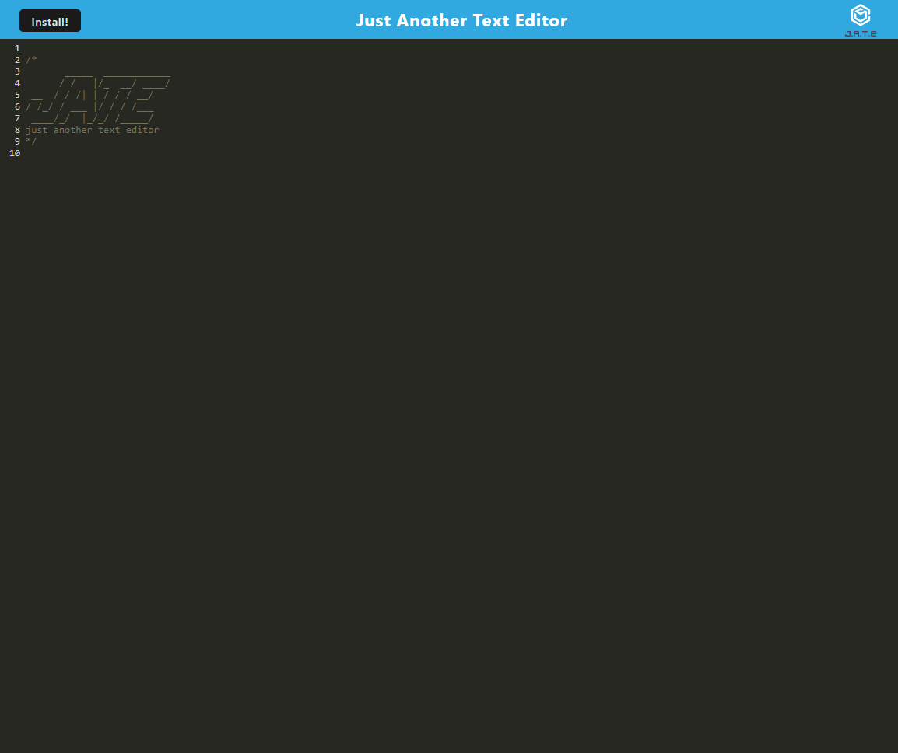

# [Just Another Text Editor](https://github.com/apatheticjedi/just-another-text-editor)

### Table of Contents

1. [Description](#description)
2. [Built With](#built-with)
3. [Installation](#installation)
4. [Usage](#usage)
5. [Contributing](#contributing)
6. [Acknowledgments](#acknowledgments)
7. [Questions](#questions)

## Description

This is a text editor Progressive Web Application (PWA) that can be used in the browser, or installed locally. Any text entered into the app is cached locally to be recalled when the application is reloaded. View the deployed application [here](https://arcane-caverns-39337.herokuapp.com/).

### Built With

* JavaScript
* HTML
* CSS
* Node.js 

## Installation

To install this application on your device, open the [Heroku Link](https://arcane-caverns-39337.herokuapp.com/) , then click the 'Install' button in the upper right hand corner of the page. To run this application on a local server, clone this repo, then type 
~~~
npm i
~~~
in the root directory to install dependencies. To create a `/dist` folder and start the localhost server, type 
~~~
npm start
~~~

(<a href="#top">back to top</a>)

## Usage

To use this application, open in the browser window and start typing . Click the 'Install' button to install this application on your device for offline use.

## Contributing

Contact me at [GitHub](https://github.com/apatheticjedi) for information on how to contribute to this application.

(<a href="#top">back to top</a>)

## Acknowledgments

* IndexedDB npm
* @babel npm
* Webpack npm
* workbox-webpack-plugin npm

## Questions

Reach out to me with questions at:

[GitHub](https://github.com/apatheticjedi)

## License

[MIT License](https://spdx.org/licenses/MIT.html)

(<a href="#top">back to top</a>)

